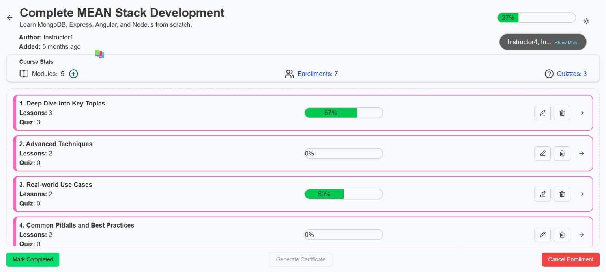
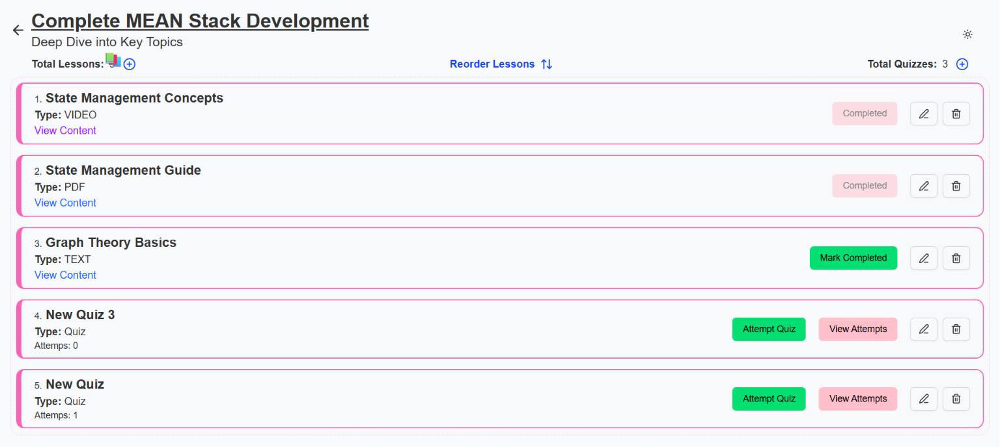
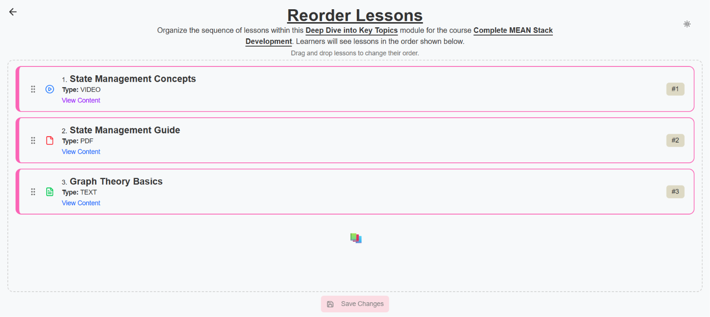

# [EduFlow – Learning Management System (LMS)](https://eduflow-campus.vercel.app/)

EduFlow is a full‑stack Learning Management System (LMS) designed to simulate a real‑world EdTech platform. The project focuses on clean role‑based architecture, secure authentication, structured course delivery, payment handling, progress tracking, and instructor–student workflows. It is built to demonstrate strong backend design, scalable data modeling, and production‑oriented features expected in modern SaaS applications.

---

## 🚀 Core Features

### Authentication & Authorization

- User registration and login using **JWT authentication**
- Role‑based access control: **Student**, **Instructor** and **Admin**
- Protected routes for dashboards and course management

### Course & Content Management (Instructor)

- Create and manage courses
- Organize courses into **modules and lessons**
- Add lessons with support for:
    - Text content
    - Video links / embeds
    - PDF resources

- Create quizzes per module (MCQ‑based)
- Mark courses as **free or paid**

### Enrollment & Payments (Student)

- Enroll in free courses instantly
- Paid course enrollment using **Razorpay**
- Coupon and discount support during order creation
- Course bundles (purchase multiple courses together)

### Learning Experience (Student)

- View enrolled courses and lessons
- Mark lessons as completed
- Attempt quizzes with **auto‑grading**
- Track quiz attempts and scores

### Dashboards & Analytics

#### **Student Dashboard**

- Course completion percentage
- Quiz history and performance overview

#### **Instructor Dashboard**

- Enrolled students per course
- Quiz performance insights
- Course‑wise engagement metrics

### Certification

- Automatic certificate generation on **100% course completion**
- Downloadable PDF certificate with:
    - Student name
    - Course title
    - Completion date
    - Unique Certificate ID for verification

### Email Notifications

- Enrollment confirmation emails
- Course announcements
- System notifications

---

## 🧠 Future Enhancements

- Lesson‑level attachments
- Video‑wise discussion forums
- Multiple instructors per course (many‑to‑many relationship)
- Real‑time video discussion forum
- Advanced analytics and reporting
- Admin panel for platform management

---

## 🏗️ Tech Stack

### Frontend

- Vite
- React.js
- Zustand
- Tailwind CSS
- dnd-kit/react

### Backend

- Node.js
- Express.js
- JWT‑based authentication
- RESTful API architecture
- PDFkit
- qrcode

### Database

- PostgreSQL
- Prisma ORM
- Well‑structured schemas for Users, Courses, Modules, Lessons, Quizzes, Enrollments, and Payments

### Payments & Services

- Razorpay for payment processing (Test mode)
- Email service
- PDF generation for certificates

---

## 🗂️ High‑Level Architecture

- **Client → API → Database** architecture
- Separation of concerns between controllers, services, and models
- Secure middleware for authentication and authorization
- Scalable schema design to support future growth

---

## 🖼️ Screenshots

### Dashboard 

### Course Home Page (Modules) 

### Lessons and Quizzes

### Re-order Lessons 

---

## 📦 Installation & Setup

```bash
# Clone the repository
git clone https://github.com/vaidikdubey/eduflow.git

# Install backend dependencies
cd ../backend
npm install

# Install frontend dependencies
cd ../frontend
npm install
```

Create a `.env` file in the backend directory:

```env
PORT=5000
DB_URL=your_db_url
JWT_SECRET=your_jwt_secret
RAZORPAY_KEY_ID=your_key_id
RAZORPAY_KEY_SECRET=your_key_secret
```

Run the application:

```bash
# Backend
npm run dev

# Frontend
npm run dev
```

---

## 🎯 Project Goals

- Demonstrate end‑to‑end full‑stack development skills
- Implement real‑world LMS workflows
- Showcase secure authentication and payment integration
- Build a scalable foundation for future features

---

## 🤝 Contributions

Contributions, suggestions, and feedback are welcome. Feel free to fork the repository and open a pull request.
